# Wazuh and MISP SOC Lab

An end-to-end Security Operations Center lab that combines Wazuh endpoint monitoring with MISP threat intelligence. The project demonstrates file integrity monitoring, security posture assessment, vulnerability review, threat intelligence correlation, investigation, and manual containment in a controlled virtual environment.

> Educational lab only. Never publish a real MISP API key, administrator password, private certificate, or production alert data.

## Project outcomes

- Windows endpoint monitored by the Wazuh agent
- Centralized File Integrity Monitoring for `C:\SOC-Lab\Monitored`
- Detection of file creation, modification, and deletion
- Windows 11 Security Configuration Assessment using the CIS benchmark
- Vulnerability Detection review in the Wazuh Dashboard
- Manual quarantine workflow for suspicious files
- MISP deployed with Docker on a separate Ubuntu virtual machine
- SHA256 IOC published in MISP with the IDS flag enabled
- Wazuh FIM alert enriched through the MISP REST API
- Successful IOC match reported as Wazuh Rule ID `100802`, alert level `12`

## Lab architecture

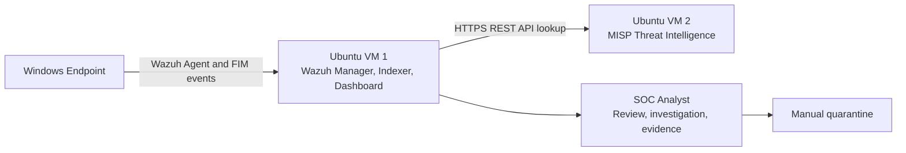

Example lab addressing used in the documentation:

| System | Example address | Purpose |
|---|---:|---|
| Wazuh server | `192.168.90.129` | Manager, Indexer, Dashboard |
| MISP server | `192.168.90.130` | Threat intelligence and REST API |
| Windows endpoint | Wazuh Agent ID `001` | FIM test endpoint |

Replace these examples with values from your own lab.

## Repository structure

```text
wazuh-misp-soc-lab/
├── README.md
├── SECURITY.md
├── .gitignore
├── configs/
│   ├── agent.conf
│   ├── misp-lab-values.env.example
│   └── ossec-misp-integration.xml.example
├── docs/
│   └── full-final-soc-with-misp-integration.docx
├── scripts/
│   ├── 01-windows-prepare.ps1
│   ├── 02-windows-fim-test.ps1
│   ├── 03-windows-quarantine.ps1
│   ├── 04-misp-docker-install.sh
│   ├── 05-wazuh-misp-integration-install.sh
│   └── 06-verify-wazuh-misp.sh
└── screenshots/
    └── 22 implementation screenshots
```

## Requirements

### Wazuh VM

- Ubuntu server with Wazuh Manager, Indexer, and Dashboard
- `sudo` access
- Network connectivity to the Windows endpoint and MISP VM

### Windows endpoint

- Wazuh Agent installed and active
- Windows PowerShell opened as Administrator
- Local folders on the `C:` drive for monitored and quarantined files

### MISP VM

- Ubuntu 24.04
- Same VMware network mode as the Wazuh VM, such as NAT or Bridged
- Recommended lab resources: 4 CPU cores, 8 GB RAM, 50 GB storage
- Docker Engine and Docker Compose plugin

# Part 1: Wazuh File Integrity Monitoring

## 1. Check Wazuh services and agent status

Run on the Wazuh Ubuntu server:

```bash
sudo systemctl status wazuh-manager --no-pager
sudo systemctl status wazuh-indexer --no-pager
sudo systemctl status wazuh-dashboard --no-pager
sudo /var/ossec/bin/agent_control -l
```

Expected result: all Wazuh services are active and the Windows agent is listed as active.

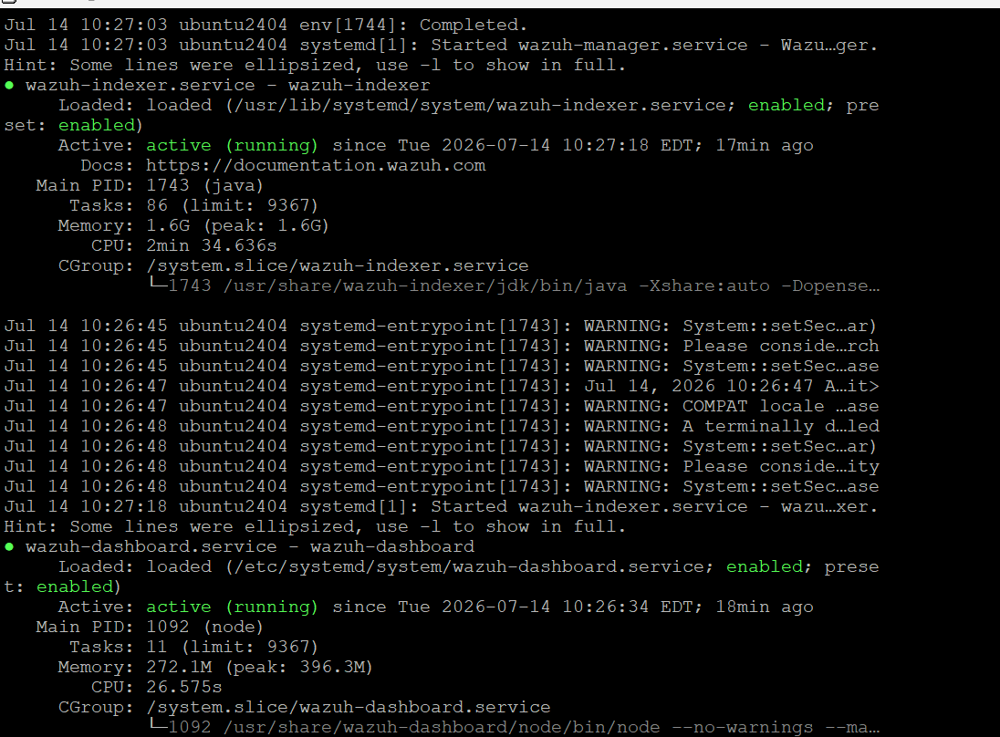


## 2. Create the centralized Windows agent group

```bash
sudo /var/ossec/bin/agent_groups -a -g windows-soc
sudo /var/ossec/bin/agent_groups -l
```

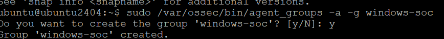

Add the Windows endpoint to the group. Replace `001` with the correct agent ID.

```bash
sudo /var/ossec/bin/agent_groups -a -i 001 -g windows-soc
sudo /var/ossec/bin/agent_groups -s -i 001
```


## 3. Create monitored and quarantine folders

Run in Windows PowerShell as Administrator:

```powershell
New-Item -ItemType Directory -Force "C:\SOC-Lab\Monitored"
New-Item -ItemType Directory -Force "C:\SOC-Lab\Quarantine"
Get-ChildItem "C:\SOC-Lab"
```

The same preparation can be performed with:

```powershell
.\scripts\01-windows-prepare.ps1
```


## 4. Create the centralized FIM configuration

Create a temporary configuration file on the Wazuh server:

```bash
sudo touch /var/ossec/etc/shared/windows-soc/agent.conf.tmp
sudo chown wazuh:wazuh /var/ossec/etc/shared/windows-soc/agent.conf.tmp
sudo chmod 660 /var/ossec/etc/shared/windows-soc/agent.conf.tmp
sudo nano /var/ossec/etc/shared/windows-soc/agent.conf.tmp
```

Paste the content from [`configs/agent.conf`](configs/agent.conf):

```xml
<agent_config os="Windows">
  <syscheck>
    <disabled>no</disabled>
    <directories check_all="yes"
                 report_changes="yes"
                 realtime="yes">C:\SOC-Lab\Monitored</directories>
  </syscheck>
</agent_config>
```


## 5. Validate and activate the configuration

```bash
sudo /var/ossec/bin/verify-agent-conf \
  -f /var/ossec/etc/shared/windows-soc/agent.conf.tmp

sudo mv /var/ossec/etc/shared/windows-soc/agent.conf.tmp \
  /var/ossec/etc/shared/windows-soc/agent.conf

sudo systemctl restart wazuh-manager
```

Do not activate the file if XML validation reports an error.


Check synchronization:

```bash
sudo /var/ossec/bin/agent_groups -S -i 001
```


## 6. Check the Windows Wazuh service

```powershell
Get-Service wazuh
Restart-Service -Name wazuh
Get-Service wazuh
```

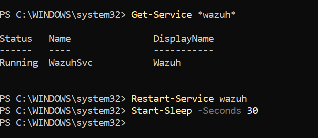

## 7. Generate FIM events

Run [`scripts/02-windows-fim-test.ps1`](scripts/02-windows-fim-test.ps1), or execute the commands manually.

### File creation

```powershell
Set-Content -Path "C:\SOC-Lab\Monitored\demo.txt" `
  -Value "Wazuh FIM Test"
Start-Sleep -Seconds 5
```

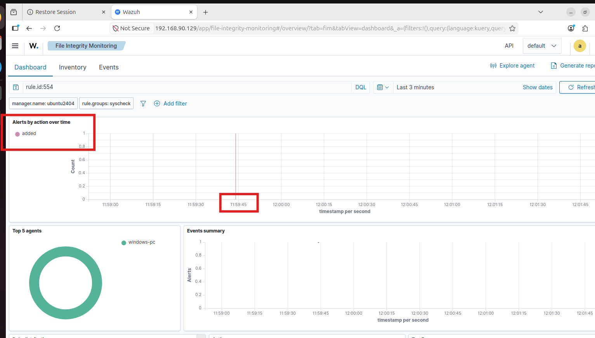

### File modification

```powershell
Add-Content -Path "C:\SOC-Lab\Monitored\demo.txt" `
  -Value "File Modified"
Start-Sleep -Seconds 5
```

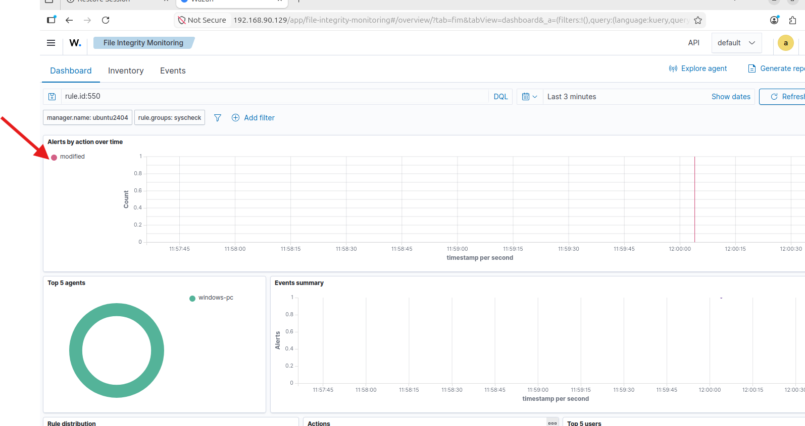

### File deletion

```powershell
Remove-Item "C:\SOC-Lab\Monitored\demo.txt"
Start-Sleep -Seconds 5
```

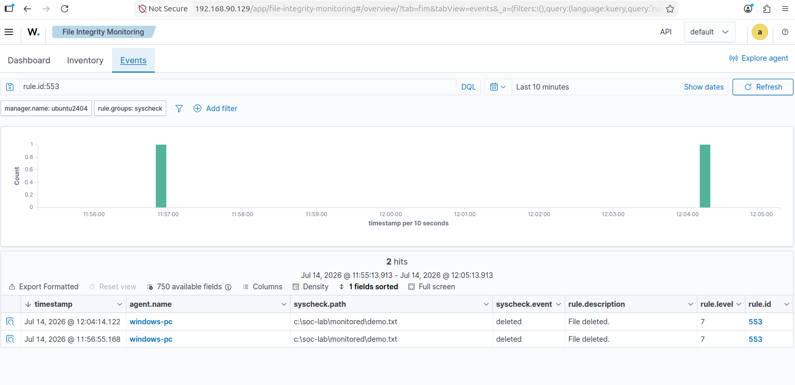

## 8. Review FIM alerts in the Wazuh Dashboard

Open **File Integrity Monitoring**, select **Events**, set a suitable time range, and filter by:

```text
rule.id: is one of 550,553,554
```

| Rule ID | Event | Expected description |
|---:|---|---|
| `554` | File added | File added to the system |
| `550` | File modified | Integrity checksum changed |
| `553` | File deleted | File deleted from the system |


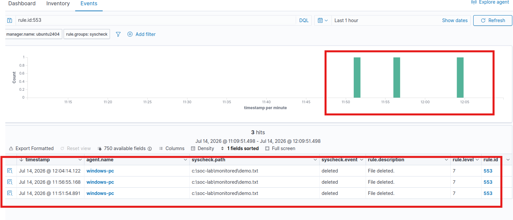

Open an event and collect the following evidence:

| Field | Meaning |
|---|---|
| `agent.name` | Windows endpoint that sent the event |
| `rule.id` | Triggered Wazuh FIM rule |
| `syscheck.path` | Changed file or directory |
| `syscheck.event` | Added, modified, or deleted |
| `syscheck.sha256_after` | SHA256 after the change, when available |
| `timestamp` | Event time |


## FIM test result

| Test | Observed result | Status |
|---|---|---|
| File creation | Rule `554` | Pass |
| File modification | Rule `550` | Pass |
| File deletion | Rule `553` | Pass |
| Agent synchronization | Synchronized | Pass |

# Part 2: Security Configuration Assessment

Wazuh SCA assessed the Windows endpoint with the **CIS Microsoft Windows 11 Enterprise Benchmark v3.0.0**.

| Result | Count |
|---|---:|
| Passed | 124 |
| Failed | 349 |
| Not applicable | 9 |
| Total checks | 482 |
| Compliance score | 26% |

A failed check does not mean the endpoint is compromised. It means that a security setting does not meet the selected benchmark recommendation. The result identifies areas for hardening, such as password policy, audit configuration, and insecure operating system settings.


# Part 3: Manual incident response

A suspicious file can be removed from the monitored folder and isolated in the quarantine folder.

Create a harmless demonstration file:

```powershell
Set-Content `
  -Path "C:\SOC-Lab\Monitored\suspicious-demo.txt" `
  -Value "Suspicious SOC Test File"
Get-ChildItem "C:\SOC-Lab\Monitored"
```

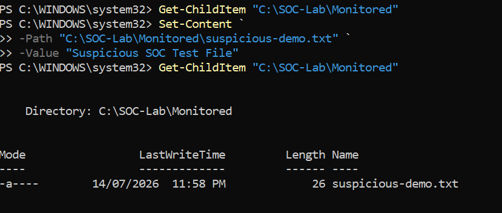

Move the file to quarantine:

```powershell
Move-Item `
  "C:\SOC-Lab\Monitored\suspicious-demo.txt" `
  "C:\SOC-Lab\Quarantine\suspicious-demo.txt"
Get-ChildItem "C:\SOC-Lab\Quarantine"
```

You can also run:

```powershell
.\scripts\03-windows-quarantine.ps1 -FileName "suspicious-demo.txt"
```

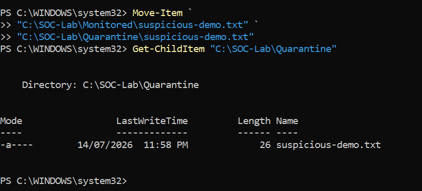

# Part 4: Vulnerability Detection

In the Wazuh Dashboard, open **Vulnerability Detection**, then review **Inventory** or **Events**.

The dashboard can show:

- CVE identifier
- Severity
- Affected package or software
- Installed version
- Recommended update or remediation

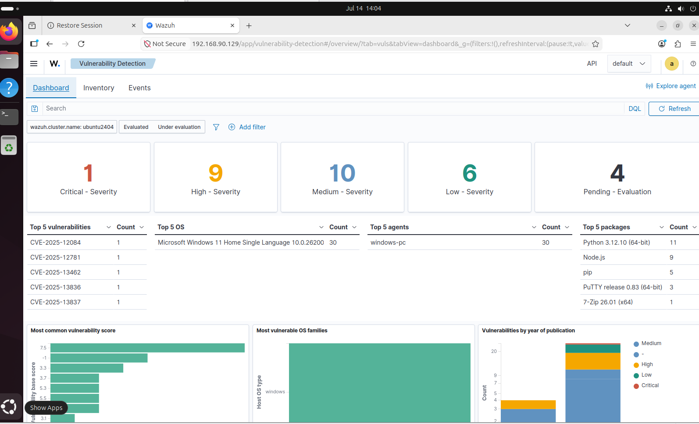

# Part 5: MISP threat intelligence platform

## 1. Prepare the MISP Ubuntu VM

```bash
sudo apt update
sudo apt upgrade -y
sudo apt install -y git curl ca-certificates openssh-server
sudo systemctl enable --now ssh
hostname -I
```

The helper script [`scripts/04-misp-docker-install.sh`](scripts/04-misp-docker-install.sh) installs Docker and downloads the MISP Docker project.

## 2. Install Docker Engine and Compose

```bash
sudo install -m 0755 -d /etc/apt/keyrings
sudo curl -fsSL https://download.docker.com/linux/ubuntu/gpg \
  -o /etc/apt/keyrings/docker.asc
sudo chmod a+r /etc/apt/keyrings/docker.asc

echo "deb [arch=$(dpkg --print-architecture) signed-by=/etc/apt/keyrings/docker.asc] https://download.docker.com/linux/ubuntu $(. /etc/os-release && echo ${UBUNTU_CODENAME:-$VERSION_CODENAME}) stable" \
  | sudo tee /etc/apt/sources.list.d/docker.list >/dev/null

sudo apt update
sudo apt install -y docker-ce docker-ce-cli containerd.io \
  docker-buildx-plugin docker-compose-plugin
sudo systemctl enable --now docker
sudo docker --version
sudo docker compose version
```

## 3. Download and start MISP

```bash
cd ~
git clone https://github.com/MISP/misp-docker.git
cd misp-docker
cp template.env .env
nano .env
```

Apply values similar to [`configs/misp-lab-values.env.example`](configs/misp-lab-values.env.example). Use a strong private password.

```dotenv
ADMIN_EMAIL=admin@soclab.local
ADMIN_ORG=SOC-LAB
ADMIN_PASSWORD=CHANGE_THIS_PASSWORD
BASE_URL=https://192.168.90.130
TZ=Asia/Dhaka
```

Start the containers:

```bash
sudo docker compose pull
sudo docker compose up -d
sudo docker compose ps
```

Open the MISP web interface:

```text
https://192.168.90.130
```

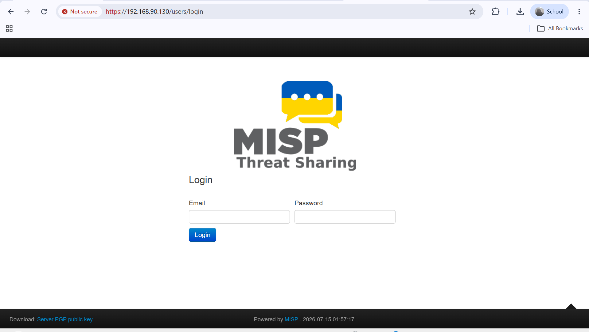

## 4. Create and publish a controlled test IOC

Create a harmless test file and calculate its SHA256 hash:

```powershell
Set-Content -Path "C:\SOC-Lab\test-misp.txt" `
  -Value "SOC MISP TEST FILE" -NoNewline

(Get-FileHash "C:\SOC-Lab\test-misp.txt" `
  -Algorithm SHA256).Hash.ToLower()
```

Create a MISP event named `SOC Lab Suspicious File IOC`, then add the SHA256 value with:

| Setting | Value |
|---|---|
| Category | Payload delivery |
| Type | `sha256` |
| For IDS | Yes |
| Distribution | Inherit event |
| Comment | Harmless file hash for Wazuh SOC lab |
| Event status | Published |

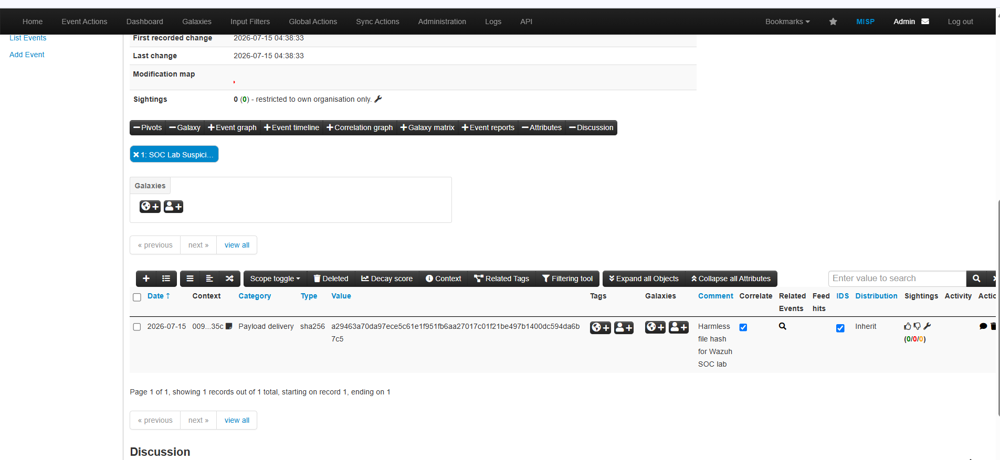

# Part 6: Wazuh and MISP integration

The Wazuh manager sends new-file FIM alerts to a custom integration script. The script extracts available MD5, SHA1, and SHA256 hashes from the alert and searches MISP for a matching attribute.

## 1. Create a restricted MISP API key

Create a dedicated read-only API key for Wazuh. Restrict it to the Wazuh server address, such as `192.168.90.129/32`.

Do not include the real key in screenshots, documentation, shell history, or GitHub.

## 2. Install the integration files

Run [`scripts/05-wazuh-misp-integration-install.sh`](scripts/05-wazuh-misp-integration-install.sh), or execute:

```bash
sudo apt update
sudo apt install -y git
cd /tmp
git clone https://github.com/MISP/wazuh-integration.git
cd wazuh-integration

sudo cp scripts/custom-misp_file_hashes.py /var/ossec/integrations/
sudo cp rules/misp_file_hashes.xml /var/ossec/etc/rules/

sudo chown root:wazuh /var/ossec/integrations/custom-misp_file_hashes.py
sudo chmod 750 /var/ossec/integrations/custom-misp_file_hashes.py
sudo chown root:wazuh /var/ossec/etc/rules/misp_file_hashes.xml
sudo chmod 640 /var/ossec/etc/rules/misp_file_hashes.xml
```

## 3. Configure Wazuh Integrator

Back up the Wazuh configuration:

```bash
sudo cp /var/ossec/etc/ossec.conf \
  /var/ossec/etc/ossec.conf.backup-before-misp
sudo nano /var/ossec/etc/ossec.conf
```

Add the block from [`configs/ossec-misp-integration.xml.example`](configs/ossec-misp-integration.xml.example) before the final `</ossec_config>` tag.

```xml
<integration>
  <name>custom-misp_file_hashes.py</name>
  <hook_url>https://192.168.90.130</hook_url>
  <api_key>REPLACE_WITH_RESTRICTED_MISP_API_KEY</api_key>
  <group>syscheck</group>
  <rule_id>554</rule_id>
  <alert_format>json</alert_format>
  <options>{
    "timeout": 10,
    "retries": 3,
    "debug": true,
    "push_sightings": false
  }</options>
</integration>
```

## 4. Self-signed certificate handling

The isolated lab used a self-signed MISP certificate. Certificate verification was disabled in the integration script's `requests.post()` calls:

```python
response = requests.post(
    ...,
    timeout=timeout,
    verify=False,
)
```

This is only acceptable for a controlled lab. In production, install a trusted certificate or add the MISP certificate authority to the Wazuh server trust store.

## 5. Validate and restart Wazuh

Run [`scripts/06-verify-wazuh-misp.sh`](scripts/06-verify-wazuh-misp.sh), or execute:

```bash
sudo /var/ossec/framework/python/bin/python3 -m py_compile \
  /var/ossec/integrations/custom-misp_file_hashes.py
sudo /var/ossec/bin/wazuh-analysisd -t
sudo systemctl restart wazuh-manager
sudo systemctl status wazuh-manager --no-pager
sudo grep -a -i "integrat" /var/ossec/logs/ossec.log | tail -30
```

Expected manager log:

```text
Enabling integration for: custom-misp_file_hashes.py
```

# Part 7: Threat intelligence correlation test

## 1. Trigger the FIM event

Copy the file whose SHA256 value is published in MISP into the monitored directory:

```powershell
Remove-Item "C:\SOC-Lab\Monitored\test-misp.txt" `
  -Force -ErrorAction SilentlyContinue
Start-Sleep -Seconds 5
Copy-Item "C:\SOC-Lab\test-misp.txt" `
  "C:\SOC-Lab\Monitored\test-misp.txt"
Start-Sleep -Seconds 20
```

## 2. Verify the integration log

```bash
sudo tail -n 50 /var/ossec/logs/integrations.log
```

A successful lookup returns `found: 1` and includes the matching SHA256 value, the MISP event UUID, and the event permalink.

## 3. Verify the high-severity Wazuh alert

Open **Threat Hunting**, select **Events**, set the time range to **Last 24 hours**, and search:

```text
rule.id:100802
```

Expected result:

- Description: MISP file hash matched
- Rule ID: `100802`
- Alert level: `12`

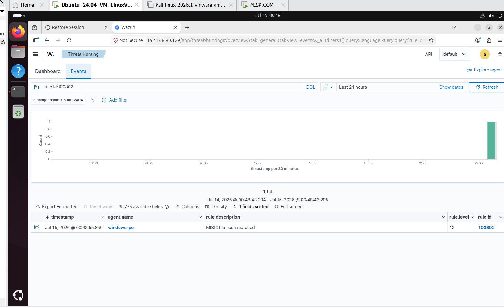

# Final result

| Component | Status |
|---|---|
| Windows Wazuh Agent | Completed |
| File Integrity Monitoring | Completed |
| Security Configuration Assessment | Completed |
| Vulnerability Detection review | Completed |
| MISP Docker deployment | Completed |
| MISP SHA256 IOC | Published with IDS enabled |
| Wazuh-MISP API integration | Completed |
| Threat intelligence correlation | Matched, Rule `100802`, Level `12` |
| Manual quarantine | Completed |

The completed workflow provides endpoint visibility, file-change detection, security posture review, vulnerability awareness, threat intelligence enrichment, investigation evidence, and manual containment.

# Troubleshooting

| Problem | Possible cause | Solution |
|---|---|---|
| Agent is not synchronized | Wrong agent ID or configuration is still distributing | Confirm the agent ID, wait 30 seconds, and restart `wazuh-manager` if needed |
| `verify-agent-conf` error | Invalid XML tag or quotation mark | Correct `agent.conf.tmp` and validate it again |
| FIM alerts do not appear | The monitored folder did not exist before the configuration was applied | Create the folder and restart the Windows Wazuh Agent |
| Events are missing from the Dashboard | Incorrect time range or filter | Select Last 24 hours and filter for rules `550`, `553`, and `554` |
| Windows service will not restart | PowerShell is not elevated | Open PowerShell as Administrator |
| Network folder is not monitored | Windows real-time FIM expects a local path | Use a local `C:` drive folder, not a UNC path or mapped drive |
| MISP lookup fails | API key, URL, network, permission, or certificate issue | Test network connectivity, confirm the restricted key, review `integrations.log`, and use a trusted certificate |
| Rule `100802` does not appear | Test hash differs from the published IOC | Recalculate the SHA256 and confirm the MISP event is published with IDS enabled |

# GitHub upload

From the repository directory:

```bash
git init
git add .
git commit -m "Add Wazuh and MISP SOC lab"
git branch -M main
git remote add origin https://github.com/YOUR-USERNAME/wazuh-misp-soc-lab.git
git push -u origin main
```

Before pushing, check that `.env`, API keys, passwords, certificates, and sensitive logs are not staged:

```bash
git status
git diff --cached
```

# Original documentation

The source Word document is preserved at [`docs/full-final-soc-with-misp-integration.docx`](docs/full-final-soc-with-misp-integration.docx).
