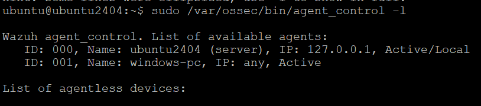
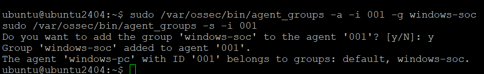
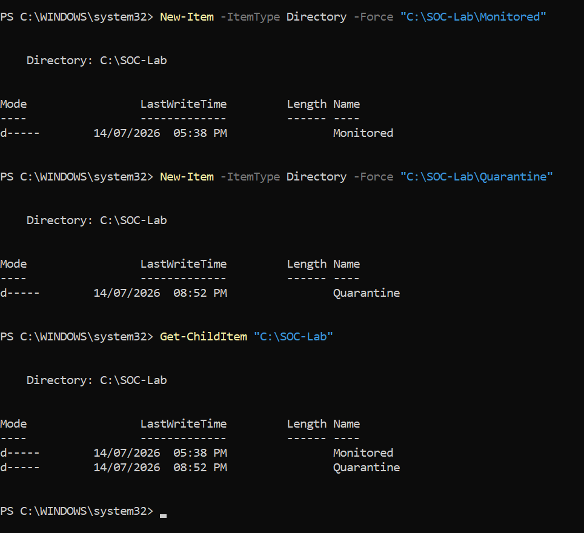
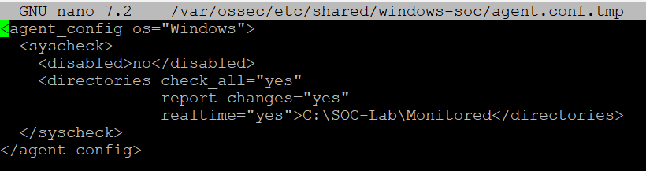
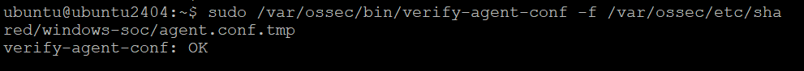
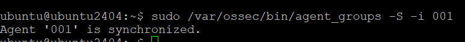
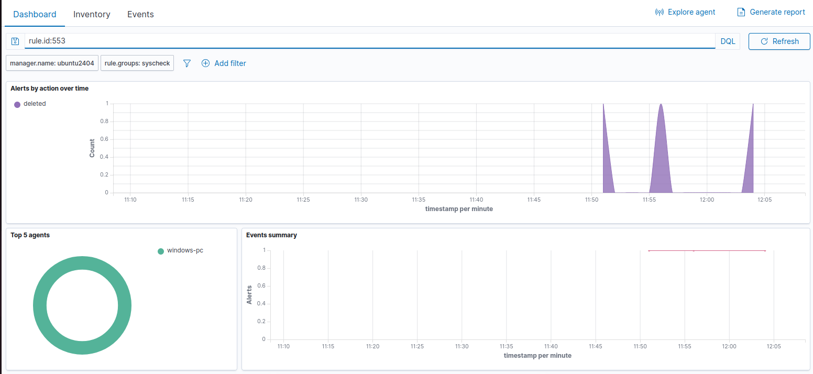
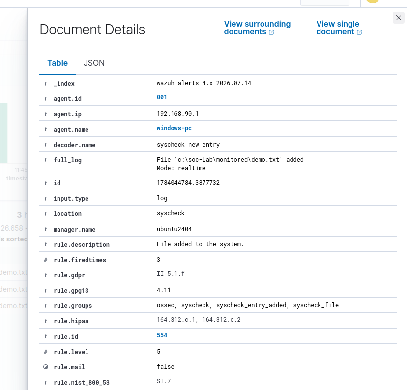
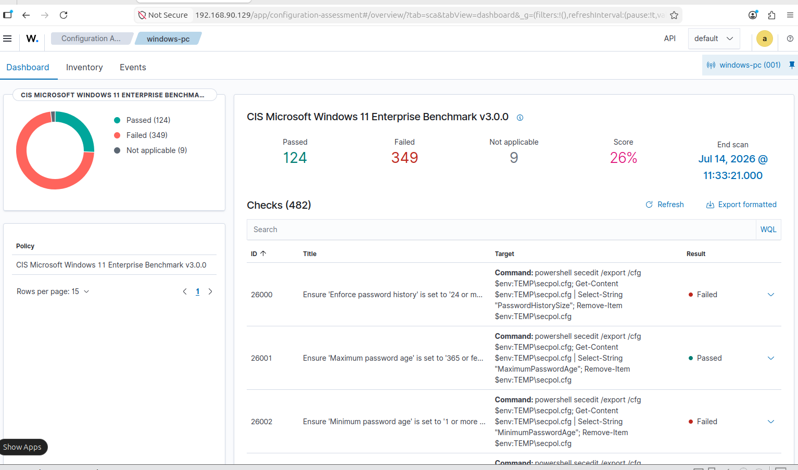

# Wazuh FIM and SCA SOC Lab

An end-to-end Security Operations Center lab for monitoring a Windows endpoint with Wazuh. The project demonstrates centralized agent configuration, real-time File Integrity Monitoring (FIM), alert investigation, evidence collection, and Security Configuration Assessment (SCA).

## Project Scope

This repository covers:

- A Windows endpoint running the Wazuh Agent
- An Ubuntu server running Wazuh Manager, Indexer, and Dashboard
- Centralized configuration through the `windows-soc` agent group
- Real-time monitoring of `C:\SOC-Lab\Monitored`
- File creation, modification, and deletion tests
- FIM alert investigation using Wazuh rule IDs `554`, `550`, and `553`
- Windows 11 security posture assessment using the CIS benchmark

> The source document title mentions MISP, but the supplied implementation evidence covers Wazuh FIM and SCA only. MISP integration is listed under future improvements.

## Lab Architecture

```text
Windows Endpoint
    |
    | File activity in C:\SOC-Lab\Monitored
    v
Wazuh Agent
    |
    v
Ubuntu Wazuh Server
    |- Wazuh Manager
    |- Wazuh Indexer
    `- Wazuh Dashboard
    |
    v
SOC Analyst
    |- Review alerts
    |- Investigate file changes
    `- Collect evidence
```

## Requirements

- Wazuh Manager, Indexer, and Dashboard running on Ubuntu
- Wazuh Agent installed and active on Windows
- `sudo` access on the Ubuntu server
- Administrator PowerShell on Windows
- A valid Windows Wazuh Agent ID

## FIM Full Process

### 1. Verify Wazuh Services and the Windows Agent

Run on the Ubuntu Wazuh server:

```bash
sudo systemctl status wazuh-manager --no-pager
sudo systemctl status wazuh-indexer --no-pager
sudo systemctl status wazuh-dashboard --no-pager
sudo /var/ossec/bin/agent_control -l
```




A reusable service-check script is available:

```bash
chmod +x scripts/linux/check-wazuh-services.sh
./scripts/linux/check-wazuh-services.sh
```

### 2. Create a Centralized Windows Agent Group

Create the `windows-soc` group:

```bash
sudo /var/ossec/bin/agent_groups -a -g windows-soc
sudo /var/ossec/bin/agent_groups -l
```


Add the Windows agent to the group. Replace `001` with the correct Agent ID:

```bash
sudo /var/ossec/bin/agent_groups -a -i 001 -g windows-soc
sudo /var/ossec/bin/agent_groups -s -i 001
```



The included helper script accepts the Agent ID as an argument:

```bash
chmod +x scripts/linux/configure-windows-agent-group.sh
./scripts/linux/configure-windows-agent-group.sh 001
```

### 3. Create the Windows Monitoring Folders

Open PowerShell as Administrator:

```powershell
New-Item -ItemType Directory -Force "C:\SOC-Lab\Monitored"
New-Item -ItemType Directory -Force "C:\SOC-Lab\Quarantine"
Get-ChildItem "C:\SOC-Lab"
```



Or run:

```powershell
Set-ExecutionPolicy -Scope Process Bypass
.\scripts\windows\setup-soc-lab-folders.ps1
```

### 4. Apply the Centralized FIM Configuration

The configuration monitors the Windows folder in real time and reports file changes:

```xml
<agent_config os="Windows">
  <syscheck>
    <disabled>no</disabled>
    <directories check_all="yes"
                 report_changes="yes"
                 realtime="yes">C:\SOC-Lab\Monitored</directories>
  </syscheck>
</agent_config>
```

The same configuration is stored in [`configs/agent.conf`](configs/agent.conf).

Manual installation on the Ubuntu server:

```bash
sudo touch /var/ossec/etc/shared/windows-soc/agent.conf.tmp
sudo chown wazuh:wazuh /var/ossec/etc/shared/windows-soc/agent.conf.tmp
sudo chmod 660 /var/ossec/etc/shared/windows-soc/agent.conf.tmp
sudo nano /var/ossec/etc/shared/windows-soc/agent.conf.tmp
```



Validate before activation:

```bash
sudo /var/ossec/bin/verify-agent-conf \
  -f /var/ossec/etc/shared/windows-soc/agent.conf.tmp
```



Activate the validated configuration:

```bash
sudo mv /var/ossec/etc/shared/windows-soc/agent.conf.tmp \
  /var/ossec/etc/shared/windows-soc/agent.conf
sudo systemctl restart wazuh-manager
```

The included installer performs these steps safely:

```bash
chmod +x scripts/linux/install-centralized-fim-config.sh
./scripts/linux/install-centralized-fim-config.sh
```

### 5. Confirm Configuration Synchronization

Replace `001` with the Windows Agent ID:

```bash
sudo /var/ossec/bin/agent_groups -S -i 001
```



### 6. Restart the Windows Wazuh Agent

Run PowerShell as Administrator:

```powershell
Get-Service *wazuh*
Restart-Service -Name WazuhSvc
Get-Service -Name WazuhSvc
```


### 7. Generate FIM Test Events

The test creates, modifies, and deletes one file. Wait several seconds between actions so the endpoint agent can send each event.

#### File Creation

```powershell
Set-Content -Path "C:\SOC-Lab\Monitored\demo.txt" `
  -Value "Wazuh FIM Test"
Start-Sleep -Seconds 5
```


#### File Modification

```powershell
Add-Content -Path "C:\SOC-Lab\Monitored\demo.txt" `
  -Value "File Modified"
Start-Sleep -Seconds 5
```


#### File Deletion

```powershell
Remove-Item "C:\SOC-Lab\Monitored\demo.txt"
Start-Sleep -Seconds 5
```


The full test can also be generated with:

```powershell
Set-ExecutionPolicy -Scope Process Bypass
.\scripts\windows\test-fim-events.ps1
```

### 8. Review Alerts in the Wazuh Dashboard

Open **File Integrity Monitoring**, select the **Events** view, and use a suitable time range such as the last 24 hours.

Use this filter:

```text
rule.id: is one of 550,553,554
```

| Rule ID | Event | Expected Description |
|---:|---|---|
| `554` | File added | File added to the system |
| `550` | File modified | Integrity checksum changed |
| `553` | File deleted | File deleted from the system |




### 9. Collect Alert Evidence

Open a FIM event and review these fields:

| Field | Meaning |
|---|---|
| `agent.name` | Windows endpoint that sent the event |
| `rule.id` | Triggered Wazuh rule |
| `syscheck.path` | Changed file or directory path |
| `syscheck.event` | Added, modified, or deleted |
| `syscheck.sha256_after` | File hash after the change, when available |
| `timestamp` | Event time |



## 2. Security Configuration Assessment

The Windows endpoint was assessed using the **CIS Microsoft Windows 11 Enterprise Benchmark v3.0.0**.

| Metric | Result |
|---|---:|
| Total checks | 482 |
| Passed | 124 |
| Failed | 349 |
| Not applicable | 9 |
| Compliance score | 26% |

A failed SCA check does not automatically mean the endpoint is compromised. It means the current setting does not match the selected CIS recommendation and may require hardening.



## Test Results

| Test | Observed Result | Status |
|---|---:|---|
| File creation | Rule `554` | Pass |
| File modification | Rule `550` | Pass |
| File deletion | Rule `553` | Pass |
| Agent configuration | Synchronized | Pass |
| SCA scan | Completed | Pass |

## Troubleshooting

Common problems and fixes are documented in [`docs/troubleshooting.md`](docs/troubleshooting.md).

## Security Notes

- Use a local Windows path for real-time FIM. Avoid mapped drives and UNC paths for this lab.
- Validate XML before replacing the active `agent.conf`.
- Use a dedicated lab endpoint before applying hardening changes.
- Review failed SCA checks individually. Some recommendations may affect usability or existing services.
- Do not upload credentials, API keys, private certificates, or access tokens to the repository.

## Future Improvements

- Add MISP threat intelligence integration
- Add automated response and quarantine workflows
- Add custom Wazuh rules for suspicious file names or hashes
- Map alerts to MITRE ATT&CK techniques
- Add email, Slack, or ticketing notifications
- Add hardened SCA remediation evidence and before-after scoring

## Upload to GitHub

Create an empty GitHub repository named `wazuh-fim-sca-soc-lab`, then run these commands from the project folder:

```bash
git init
git add .
git commit -m "Add Wazuh FIM and SCA SOC lab"
git branch -M main
git remote add origin https://github.com/YOUR-USERNAME/wazuh-fim-sca-soc-lab.git
git push -u origin main
```

Replace `YOUR-USERNAME` with your GitHub username. Add a license before publishing if you want other people to reuse the project.

## Source Documentation

The original DOCX used to build this repository is stored at:

[`docs/source/wazuh-fim-sca-lab-documentation.docx`](docs/source/wazuh-fim-sca-lab-documentation.docx)
